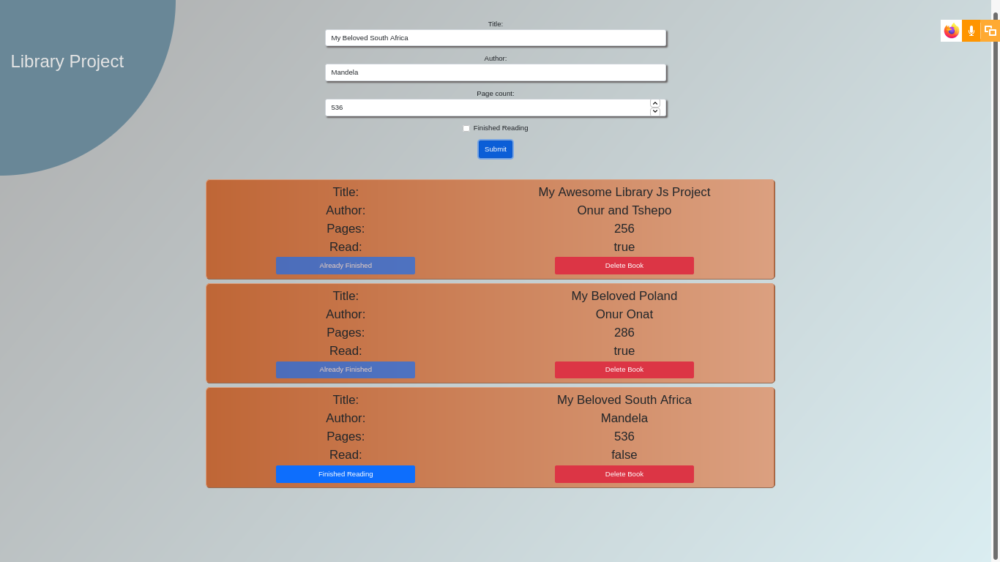

# library-project

## Project Decription
A lightweight JavaScript project that allows users to interact with a fully client-based interface.
Users can add books that they've read or are planning to read to the page to easily keep track of them.
The added books can be modified by buttons provided to the users. A user can change the status of the book from unfinished to finished, or remove a book as they desire.

## Project Design
The books are displayed on cards to separate them, allowing for a tidier experience for the users.
The contrast between the colours of foreground and background makes the book cards more visible and more accessible.

## Screenshot of the page

## Build With

- HTML
- CSS
- JavaScript
- SASS
- Bootstrap

## Contributors

👤 **Onur Onat Surmeli**

- [GitHub](https://github.com/Zibilyonik)
- [Twitter](https://twitter.com/OnurSurmeli2)
- [LinkedIn](https://www.linkedin.com/in/onuronatsurmeli/)

👤 **TSHEPO DAVID MOLEFE**

- [GitHub](https://github.com/TSHEPO-CLOUD)
- [Twitter](https://twitter.com/tshepomolefem)
- [LinkedIn](https://www.linkedin.com/in/tshepo-molefe-8153313b)

## 🤝 Contributing

Contributions, issues and feature requests are welcome!

Feel free to check the [issues page](issues/).

## Show your support

Give a ⭐️ if you like this project!

